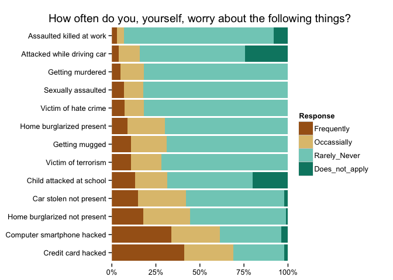

source code and data files for the [dds.ec blog post](http://dds.ec/blog/2014/Oct/don't-worry-too-much-about-the-gallup-crime-poll/)

[Gallup Crime "Worry" Poll](http://www.gallup.com/file/poll/178877/141027CrimeWorry.pdf) [PDF]

(and mirroed here)

``` r
library(reshape2)
library(ggplot2)
library(scales)
library(RColorBrewer)
library(dplyr)
```

    ## 
    ## Attaching package: 'dplyr'
    ## 
    ## The following object is masked from 'package:stats':
    ## 
    ##     filter
    ## 
    ## The following objects are masked from 'package:base':
    ## 
    ##     intersect, setdiff, setequal, union

``` r
all <- read.csv("data/all-crimes-summary.csv", header=TRUE, stringsAs=FALSE, sep=",")
all$Crime <- factor(all$Crime, all$Crime, ordered=TRUE)
all_m <- melt(all, id.vars = c("Crime"))
colnames(all_m) <- c("Crime", "Response", "Value")

gg <- ggplot(all_m, aes(x=Crime, y=Value, fill=Response))
gg <- gg + geom_bar(position="fill", stat="identity")
gg <- gg + scale_y_continuous(labels = percent_format(), expand=c(0,0))
gg <- gg + scale_fill_brewer(palette="BrBG", type="div")
gg <- gg + coord_flip()
gg <- gg + labs(x=NULL, y=NULL, title="How often do you, yourself, worry about the following things?")
gg <- gg + theme_bw()
gg <- gg + theme(panel.grid=element_blank())
gg <- gg + theme(panel.border=element_blank())
gg
```



Data files:

-   `data/all-crimes-summary.csv` is the first summary table in the Gallup Poll PDF
-   `data/responses-by-crime-by-year.csv` is the data from all the other tables (responses/year)
